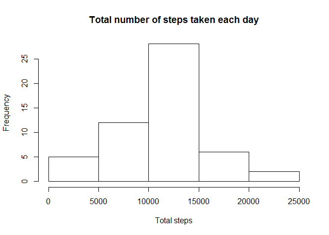

# Reproducible Research: Peer Assessment 1

Author: iNocebo  
Course: repdata-13, April 2015  

## Credits
- R: [R Development Core Team (2008). R: A language and environment for statistical computing. R Foundation for Statistical Computing, Vienna, Austria. ISBN 3-900051-07-0](http://www.R-project.org)
- RStudio: Version 0.98.1091
- {dplyr}: [Hadley Wickham and Romain Francois (2015). dplyr: A Grammar of Data Manipulation. R package version 0.4.1.](http://CRAN.R-project.org/package=dplyr)
- {lattice}:  Sarkar, Deepayan (2008) Lattice: Multivariate Data Visualization with R. Springer, New York. ISBN 978-0-387-75968-5
- {knitr}: Yihui Xie (2015). knitr: A General-Purpose Package for Dynamic Report Generation in R. R package
  version 1.9.

## Loading and preprocessing the data
The zipped folder needs to be in the working directory: Please make sure to have it there.  
Unzip the folder

```r
unzip("activity.zip")
```

Load the data

```r
data <- read.csv("activity.csv")
```

For the first assignment steps there is no need for a preprocessing step

## What is mean total number of steps taken per day?
We need {dplyr} for the next part, let's load it (in case you have not installed it: install.packages("dplyr"))

```r
library(dplyr)
```

Calculate the total number of steps taken per day: With the help of {dplyr} we group the data by date and calculate the sum of the steps for each of these days. Note: NAs need to be thrown out in this step of the assignment

```r
total_steps_day <-
  data %>%
  na.omit() %>%
  group_by(date) %>%
  summarise(total_steps = sum(steps))
```

Make a histogram of the total number of steps taken each day

```r
hist_total_steps <- hist(total_steps_day$total_steps,
                         main = "Total number of steps taken each day",
                         xlab = "Total steps",
                         ylab = "Frequency")
```

 

Calculate and report the mean and median of the total number of steps taken per day: We can use the summary function for this task

```r
summary_steps <- summary(total_steps_day$total_steps)
print (summary_steps)
```

```
##    Min. 1st Qu.  Median    Mean 3rd Qu.    Max. 
##      41    8841   10760   10770   13290   21190
```

## What is the average daily activity pattern?
Let's make a time series plot of the 5-minute interval and the average number of steps taken, averaged across all days, using {dplyr}

```r
average_steps_interval <-
  data %>%
  na.omit() %>%
  group_by(interval) %>%
  summarise(average = mean (steps))

plot_average_interval <- plot(average_steps_interval, type = "l",
                              main = "Average steps taken each interval",
                              xlab = "5-minute intervals",
                              ylab = "Average number of steps taken (averaged across all days)")
```

 

Which 5-minute interval, on average across all the days in the dataset, contains the maximum number of steps?

```r
max_average_interval <- subset(average_steps_interval, 
                               average == max(average_steps_interval$average), 
                               select = interval)
print(max_average_interval)
```

```
## Source: local data frame [1 x 1]
## 
##   interval
## 1      835
```

## Imputing missing values
First, let's see how many NAs are actually in the data set

```r
total_na <- length(data$steps[is.na(data$steps) == TRUE])
print(total_na)
```

```
## [1] 2304
```

Now, we will use the mean for the given interval to fill in numbers into the NA-slots. This method has little impact on the dataset as a whole, especially when using means in the later parts. To do this, we first use {dplyr} to calculate the mean steps taken in the given interval

```r
mean_steps_interval <-
  data %>%
  na.omit() %>%
  group_by(interval) %>%
  summarise(mean_steps = mean(steps))
```

Now we merge the mean by interval with the original data and overwrite the steps taken with the mean if there is a NA

```r
data_impute <- merge(data, mean_steps_interval, by = "interval")
data_impute <- within(data_impute, steps <-
                        ifelse(is.na(steps), mean_steps, steps))
```

Let's take a look at the histogram now with imputed missing values

```r
total_steps_day_imputed <-
  data_impute %>%
  group_by(date) %>%
  summarise(total_steps = sum(steps))

hist_total_steps_imputed <- hist(total_steps_day_imputed$total_steps,
                                 main = "Total number of steps taken (imputed)",
                                 xlab = "Total steps",
                                 ylab = "Frequency")
```

 

We can also compare the summaries to see the changes introduced by this imputation process

```r
summary_comparison <- rbind(summary_steps, summary_steps_imputed = 
                              summary(total_steps_day_imputed$total_steps))
print(summary_comparison)
```

```
##                       Min. 1st Qu. Median  Mean 3rd Qu.  Max.
## summary_steps           41    8841  10760 10770   13290 21190
## summary_steps_imputed   41    9819  10770 10770   12810 21190
```
The changes made to the mean, the median and also max and min are not disturbing

## Are there differences in activity patterns between weekdays and weekends?
For this part of the analysis we use the data with imputed missing values

```r
weekday_imputed <- data_impute
```

First, we need to change the language to English because this is an international course

```r
Sys.setlocale("LC_TIME", "English")
```

```
## [1] "English_United States.1252"
```

Now we want to introduce a new factor into our data distinguishing between weekdays and weekend. So we need a vector which defines what a weekday is

```r
weekday_definition <- c("Monday", "Tuesday", "Wednesday", "Thursday", "Friday")
```

Let's add a variable containing the exact day instead of just the date to the data

```r
weekday_imputed <- mutate(weekday_imputed, 
                          weekday = weekdays(strptime(weekday_imputed$date,
                                                      "%Y-%m-%d")))
```

Is it a weekday or a weekend? Let's add a factor containing this information

```r
weekday_imputed$factor <-  
  factor((weekday_imputed$weekday %in% weekday_definition)+1L, levels=1:2,
         labels=c('weekend', 'weekday'))
```

Now we want to make a panel plot containing a time series plot of the 5-minute interval and the average number of steps taken, averaged across all weekday days or weekend days. For the calculation of the average we once again use {dplyr}, which does not like dates in the POSIXlt class, which we needed to add descriptive weekdays. We need to change the dates back to characters to be able to group by interval and the newly introduced factor distinguishing between weekdays and weekend

```r
weekday_imputed$date <- as.character(weekday_imputed$date)

weekday_average <-
  weekday_imputed %>%
  group_by(interval, factor) %>%
  summarise(average = mean(steps))
```

For the plotting we use {lattice}, let's load it

```r
library(lattice)
```

Let's do the plotting

```r
xyplot(average ~ interval | factor,
       data = weekday_average,
       layout = c(1, 2),
       type = "l", 
       index.cond = list(c(2,1)),
       main = "Average steps taken during each interval by weekday/weekend",
       xlab = "Interval",
       ylab = "Average number of steps taken")
```

 

In this graph we can see that - compared to the weekend - the subject gets up earlier during weekdays, has a higher amount of activity in the morning, and does less steps during working hours. The activity during weekends is distributed more evenly throughout the day.
